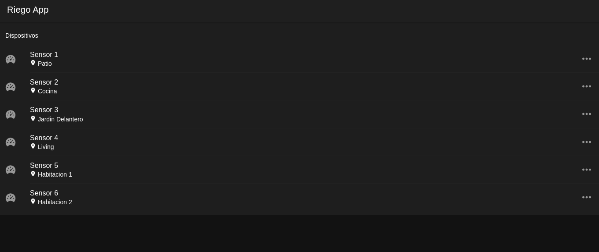
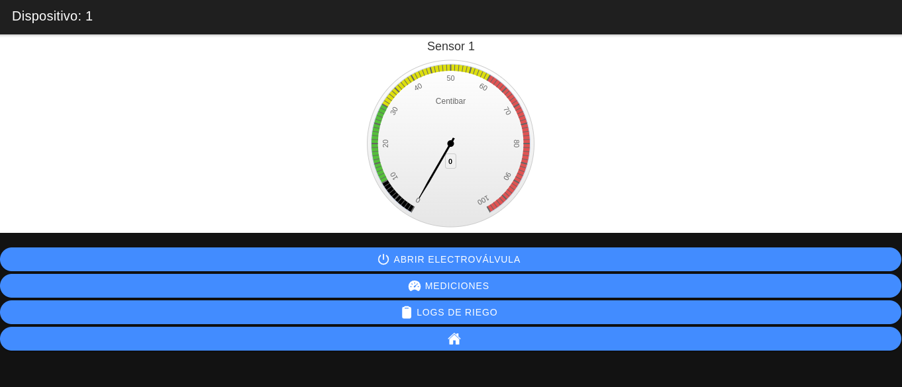
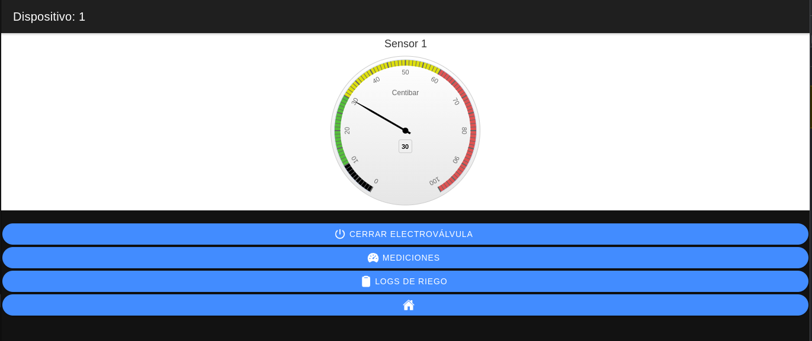
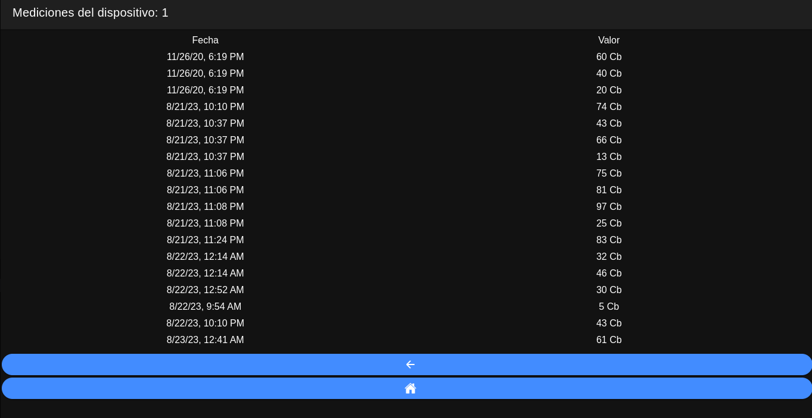
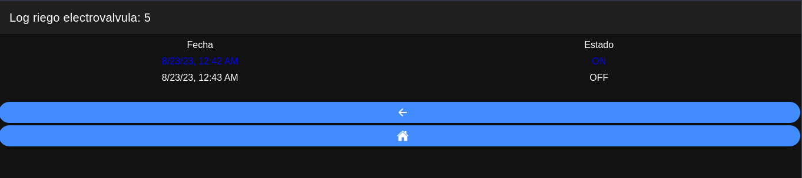

Web App Full Stack Base - Ionic frontend
========================================

Proyecto basado en [Web App Full Stack Base](https://github.com/gotoiot/app-fullstack-base).

En esta extensión del proyecto se utiliza el framework ionic para realizar el frontend.

## Comenzando 🚀

Esta sección es una guía con los pasos esenciales para que puedas poner en marcha la aplicación.

### Instalar las dependencias

Para correr este proyecto es necesario que instales `Docker` y `Docker Compose`. 

En [este artículo](https://www.gotoiot.com/pages/articles/docker_installation_linux/) publicado en nuestra web están los detalles para instalar Docker y Docker Compose en una máquina Linux. Si querés instalar ambas herramientas en una Raspberry Pi podés seguir [este artículo](https://www.gotoiot.com/pages/articles/rpi_docker_installation) de nuestra web que te muestra todos los pasos necesarios.

En caso que quieras instalar las herramientas en otra plataforma o tengas algún incoveniente, podes leer la documentación oficial de [Docker](https://docs.docker.com/get-docker/) y también la de [Docker Compose](https://docs.docker.com/compose/install/).

Continua con la descarga del código cuando tengas las dependencias instaladas y funcionando.

### Ejecutar la aplicación

Para ejecutar la aplicación tenes que correr el comando `docker compose up` desde la raíz del proyecto `./TP_DAM_IoT`. Este comando va a descargar las imágenes de Docker de node, de typescript, de la base datos y del admin de la DB, y luego ponerlas en funcionamiento. 

Para acceder al cliente web ingresa a a la URL [http://localhost:8100/](http://localhost:8100/) y para acceder al admin de la DB accedé a [localhost:8001/](http://localhost:8001/). 

Si pudiste acceder al cliente web y al administrador significa que la aplicación se encuentra corriendo bien. 

> 👁️ Si te aparece un error la primera vez que corres la app, deteńe el proceso y volvé a iniciarla. Esto es debido a que el backend espera que la DB esté creada al iniciar, y en la primera ejecución puede no alcanzar a crearse. A partir de la segunda vez el problema queda solucionado.

### Sobre la aplicación

En esta aplicacion vas a poder ver la información de los sensores de riego en la pantalla principal o home:

Al entrar en alguno de los sensores veras la información de la ultima medicion del dispositivo en el gauge o indicador: 

La interpretación de la lectura del indicador varía según el cultivo, el tipo de suelo y curva de humedad correlacionada. Sin embargo, se puede tomar de referencia que de 0 a 10 centibares (Cb) el suelo está saturado; de 10 a 30 Cb, el suelo está en CC; y, de 30 a 60 Cb, el suelo está seco y debe regarse de inmediato.

> 👁️ Si no te carga el Gauge o Indicador prueba `docker compose down` y luego `docker compose up` para levantar nuevamente la aplicación. O simplemente refrescá la página con F5.

Desde el menú del dispositivo se puede abrir y cerrar la electroválvula del dispositivo :

En el caso de que se abra o se cierre dicha electroválvula, se inserta un registro en el log de riego y otro en la tabla de mediciones con el nuevo valor, este último solamente si se cierra la electroválvula.

También se puede consultar el log de mediciones del sensor:

Y el log de riego:

## Licencia 📄

Este proyecto está bajo Licencia ([MIT](https://choosealicense.com/licenses/mit/)). Podés ver el archivo [LICENSE.md](LICENSE.md) para más detalles sobre el uso de este material.
